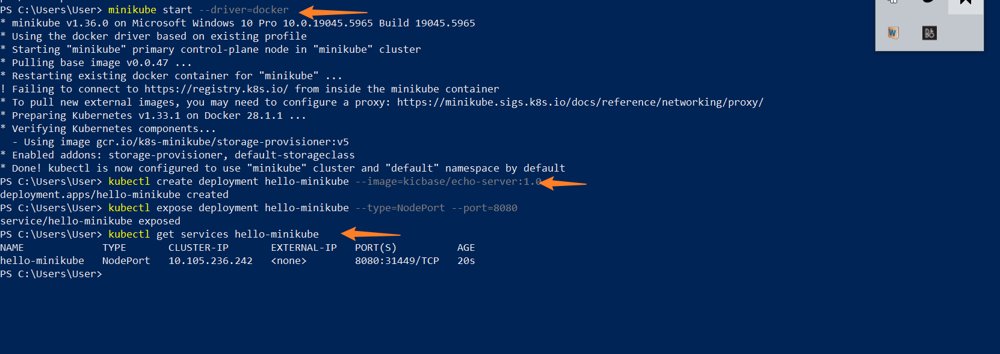
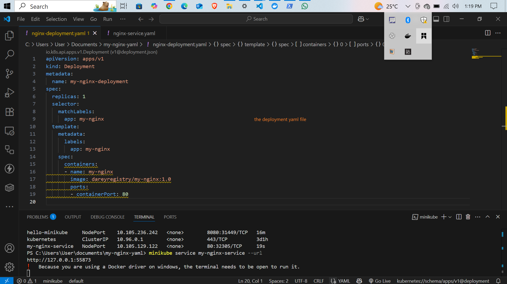
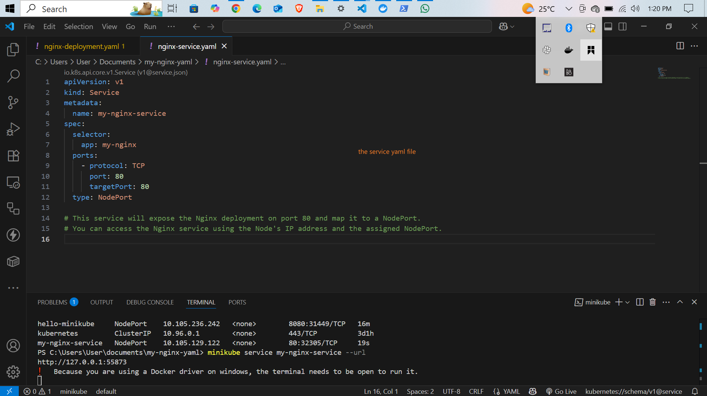
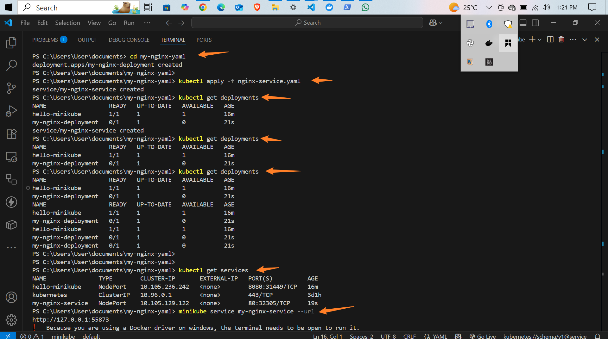
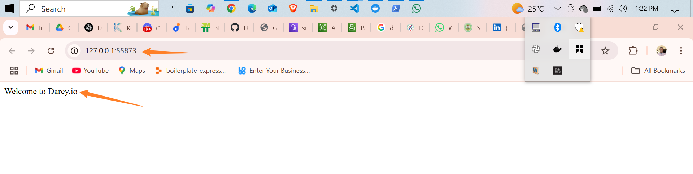

# My Nginx Deployment with Docker and Kubernetes

This is a brief overview of how I deployed an Nginx service using Docker and Kubernetes, and how I accessed it locally.

## My Process

### 1. Starting Minikube with Docker

First, I started Minikube using the Docker driver to make the setup more efficient:

```bash
minikube start --driver=docker
```

### 2. Building the Docker Image

Next, I built a Docker image for Nginx from my project folder:

```bash
docker build -t my-nginx .
```

### 3. Creating the Kubernetes Deployment

Then, I created a deployment configuration for my Nginx container. I used a YAML file to define the deployment with 1 replica, specifying the image I just built, and exposing port 80.

script here [text](./nginx-deployment.yaml)
```bash
apiVersion: apps/v1
kind: Deployment
metadata:
  name: my-nginx-deployment
spec:
  replicas: 1
  selector:
    matchLabels:
      app: my-nginx
  template:
    metadata:
      labels:
        app: my-nginx
    spec:
      containers:
      - name: my-nginx
        image: dareyregistry/my-nginx:1.0
        ports:
        - containerPort: 80

```
I applied this configuration with:

```bash
kubectl apply -f nginx-deployment.yaml
```

### 4. Exposing the Deployment as a Service

To make my Nginx accessible, I created a Kubernetes service of type NodePort. This service maps port 80 in the container to a port on my localhost.

script here [script](./nginx-service.yaml)

```bash
apiVersion: v1
kind: Service
metadata:
  name: my-nginx-service
spec:
  selector:
    app: my-nginx
  ports:
    - protocol: TCP
      port: 80
      targetPort: 80
  type: NodePort
```
# This service will expose the Nginx deployment on port 80 and map it to a NodePort.
# You can access the Nginx service using the Node's IP address and the assigned NodePort.


```bash
kubectl apply -f nginx-service.yaml
```

### 5. Verifying and Accessing the Service

I checked that everything was running correctly:

```bash
kubectl get deployments
kubectl get services
```

I found the dynamically assigned port for accessing my service, which was `55873`.

Finally, I opened my web browser and navigated to:

```
http://127.0.0.1:55873
```

and was greeted by the Nginx welcome page.


---
## screen Shot






## Conclusion

Through this process, I was able to set up a local Nginx server on my machine using Docker and Kubernetes, verify its deployment, and access it via a browser. This helped me understand containerization and deploying services with Kubernetes much better