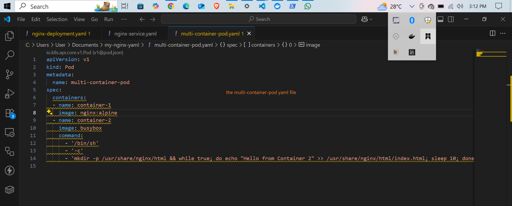
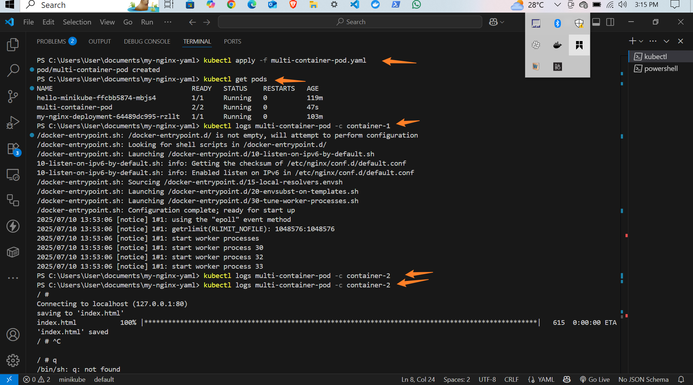
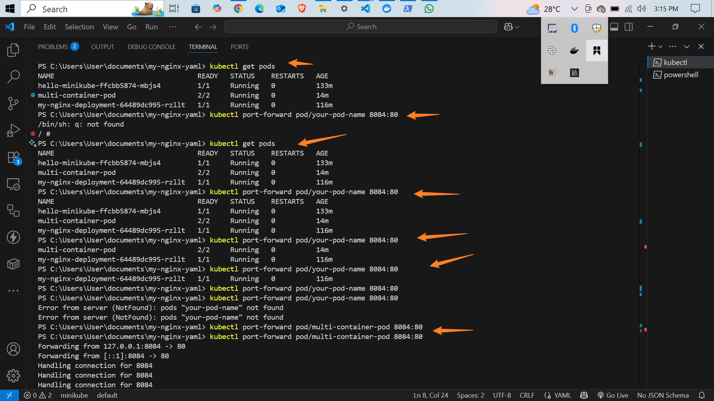

# Kubernetes Multi-Container Pod Networking and Access Configuration

## Overview
This project involved deploying a multi-container pod in a Kubernetes environment, setting up network interfaces, forwarding ports, and managing inter-pod communication. The core aim was to understand and implement fundamental networking concepts in Kubernetes, such as pod-to-pod communication, service exposure, ingress, and network policies.

---

## Steps Overview

### 1. Creating the Multi-Container Pod
- Defined a YAML manifest for deploying a pod with multiple containers (`multi-container-pod.yaml`).
```bash
apiVersion: v1
kind: Pod
metadata:
  name: multi-container-pod
spec:
  containers:
  - name: container-1
    image: nginx:alpine
  - name: container-2
    image: busybox
    command:
      - '/bin/sh'
      - '-c'
      - 'mkdir -p /usr/share/nginx/html && while true; do echo "Hello from Container 2" >> /usr/share/nginx/html/index.html; sleep 10; done'

```
- Used `kubectl apply -f multi-container-pod.yaml` to create the pod.
- Verified the pod status with `kubectl get pods`.

### 2. Accessing the Pod and its Containers
- Checked pod status and logs with `kubectl logs`.
- Executed commands within the container using `kubectl exec` to test network connectivity and scripts.

### 3. Port Forwarding
- Exposed specific container ports to the host for local testing using:
  ```bash
  kubectl port-forward pod/multi-container-pod 8084:80
  ```
- This allowed access to container services via localhost on specified ports.

### 4. Pod-to-Pod Communication
- Verified inter-container communication within the same pod and across different pods by checking connectivity.
- Ensured that containers can communicate over the network using container ports and internal IPs.

### 5. Service Creation and Access
- Created Kubernetes services to expose the pods:
  - ClusterIP (default) for internal communication
  - NodePort for external access
- Ensured that services correctly route traffic to the pods.

### 6. Load Balancing and External Access
- Set up port forwarding to simulate external access.
- Validated that external traffic can reach the services and that the pods respond accordingly.

---

## Key Concepts

### Pod Networking
- Each pod in Kubernetes receives its own IP address, enabling direct communication between pods.
- Containers within the same pod share the same network namespace, allowing localhost communication.

### Service Networking
- Services provide a stable IP address and DNS name to access one or more pods.
- Types of services:
  - ClusterIP: accessible within the cluster
  - NodePort: accessible externally via node IP and port
  - LoadBalancer: integrates with cloud load balancers for external traffic

### Pod-to-Pod Communication
- Facilitated through pod IPs or service DNS.
- Pods can communicate directly over the network using their assigned IP or service name.

### Ingress
- An API object that manages external access to services, typically HTTP/HTTPS.
- Provides routing rules, SSL termination, and load balancing for incoming traffic.

### Network Policies
- Define rules to control traffic flow between pods and namespaces.
- Used to enhance security by restricting communication based on policies.

### Container Network Interface (CNI)
- A specification and plugins used by Kubernetes to configure network interfaces in containers.
- Ensures connectivity and network isolation for pods, supporting various network plugins.


## Screen Shots



---

## Conclusion
This project demonstrated how to configure and test network connectivity within a Kubernetes cluster. Managing port forwarding, service creation, and inter-pod communication are essential skills for deploying scalable and secure containerized applications.

---

