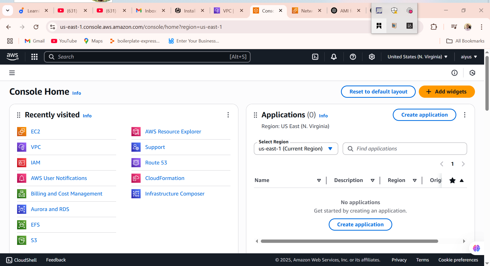
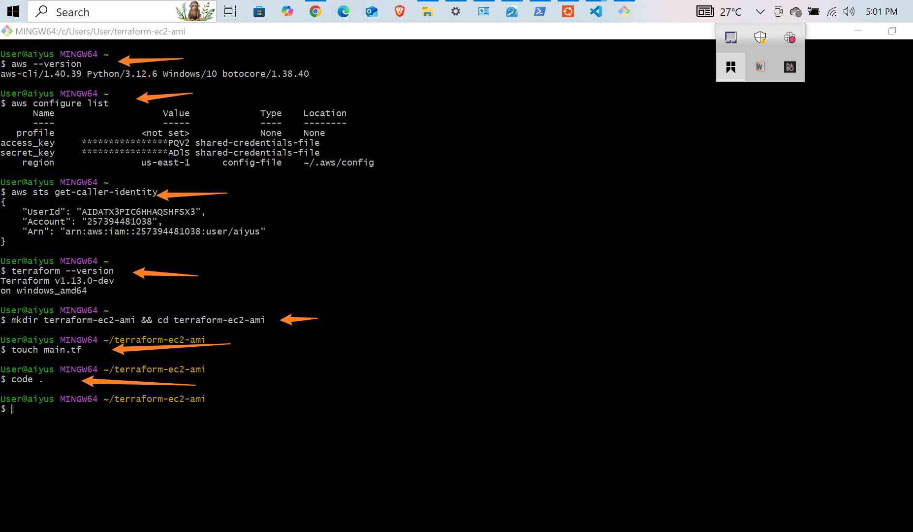
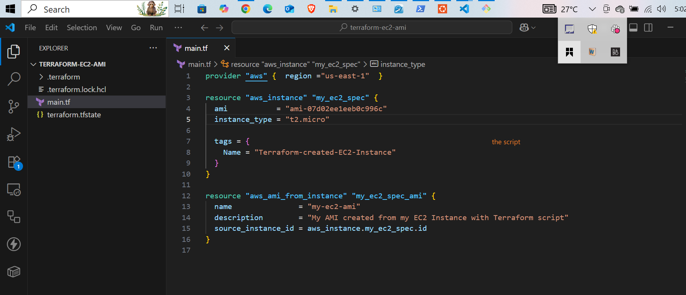
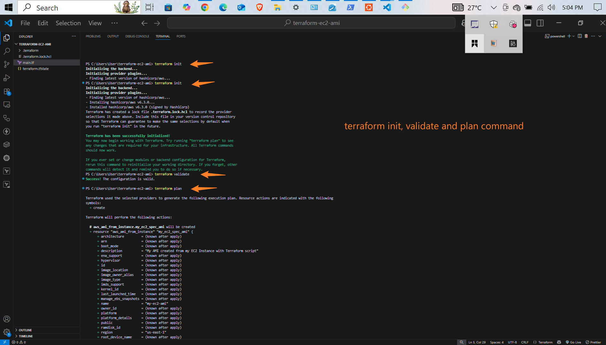
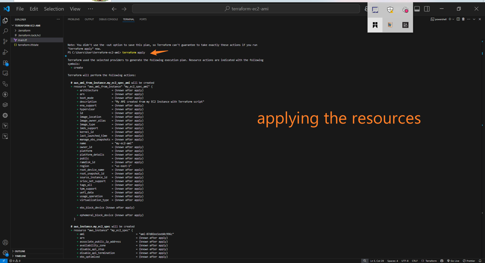
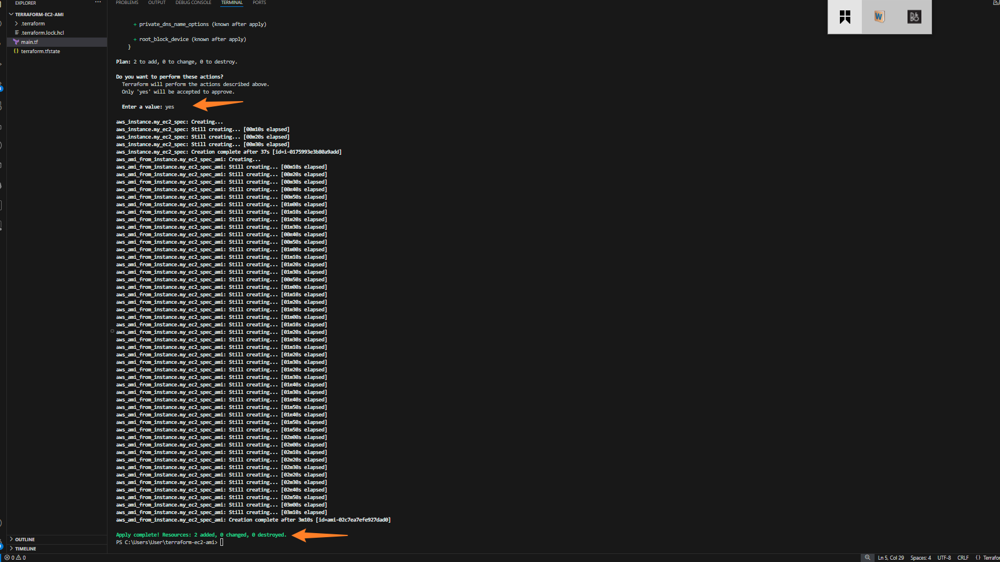
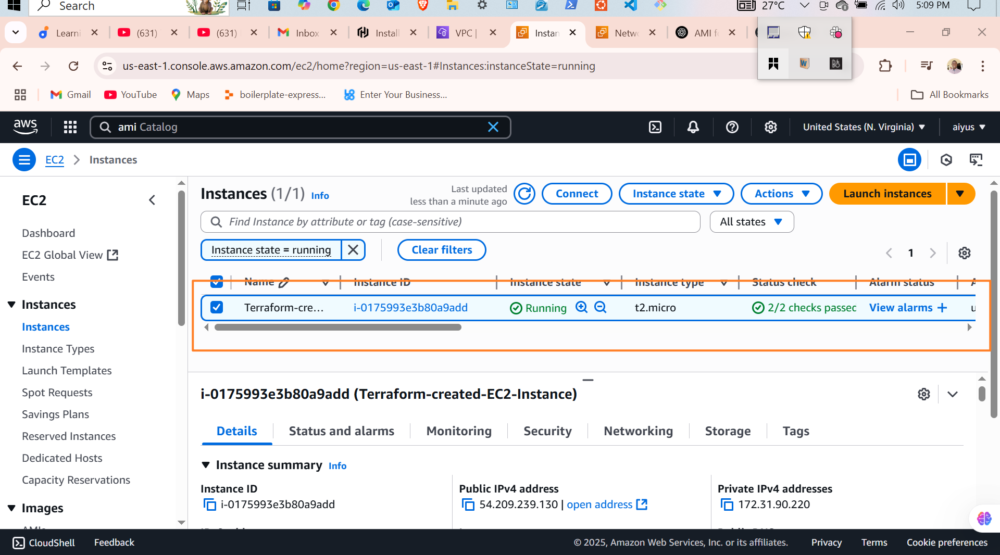
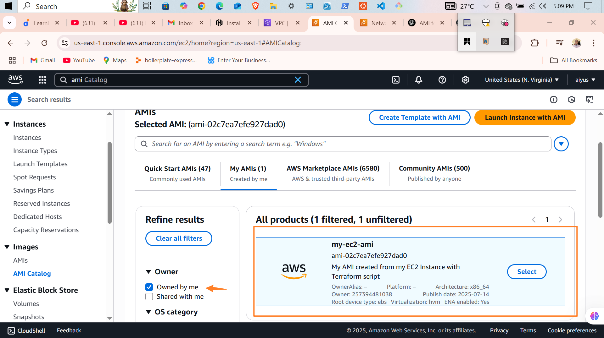
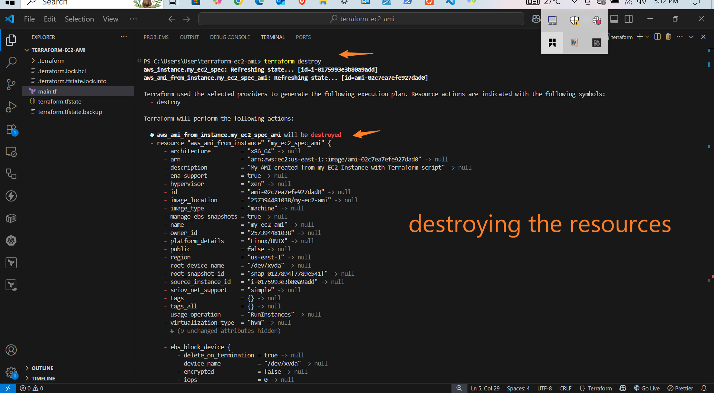
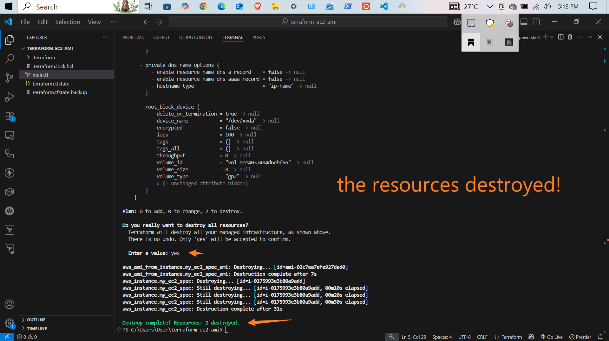

Sure! Here's your improved Terraform EC2 deployment guide rewritten using **first-person pronouns**, making it more personal and instructional — great for blog posts, tutorials, or documentation written from your perspective:

---

# 🚀 My Terraform EC2 Instance Deployment on AWS

In this project, I’ll walk you through how I **create**, **verify**, and **destroy** an EC2 instance using **Terraform** on **AWS**. I use the AWS CLI and Terraform to automate the setup, and I clean everything up when I’m done to avoid extra charges.

---

## 🧰 What I Needed First

Before I started, I made sure I had the following:

* ✅ An AWS account with the right permissions
* ✅ AWS CLI installed and configured
* ✅ Terraform installed on my machine

---

## 🔁 My Step-by-Step Workflow

### 1️⃣ I Verified My AWS CLI Configuration

To confirm that the AWS CLI was set up correctly, I ran:

```bash
aws configure list
```

### 2️⃣ I Checked My AWS Identity

Just to be sure I was using the right account, I used:

```bash
aws sts get-caller-identity
```

### 3️⃣ I Created My Project Directory

Then I created a folder for the project and moved into it:

```bash
mkdir terraform-ec2-ami && cd terraform-ec2-ami
```

---

## ✏️ I Wrote My Terraform Configuration

### 4️⃣ I Created the `main.tf` File

Inside the project folder, I added this configuration:

```hcl
provider "aws" {
  region = "us-east-1"
}

resource "aws_instance" "my_ec2" {
  ami           = "ami-07d02ee1eeb0c996c" # Ubuntu 22.04 LTS (x86_64) in us-east-1
  instance_type = "t2.micro"

  tags = {
    Name = "Terraform-EC2-Instance"
  }
}

resource "aws_ami_from_instance" "my_ec2_ami" {
  name               = "Terraform-AMI-from-EC2"
  source_instance_id = aws_instance.my_ec2.id
  description        = "AMI created from EC2 instance using Terraform"
  depends_on         = [aws_instance.my_ec2]
}
```

> 💡 I used an Ubuntu 22.04 LTS AMI in `us-east-1`. You can replace it with a different one if needed.

---

## ⚙️ Running Terraform

### 5️⃣ I Initialized Terraform

```bash
terraform init
```

This downloaded the necessary provider plugins and prepared Terraform for deployment.

### 6️⃣ I Validated the Configuration

```bash
terraform validate
```

This helped me confirm that my configuration syntax was correct.

### 7️⃣ I Reviewed the Execution Plan

```bash
terraform plan
```

This command showed me exactly what Terraform was going to create.

### 8️⃣ I Applied the Configuration

```bash
terraform apply
```

I typed `yes` when prompted, and Terraform created both the EC2 instance and the AMI.

✅ My output looked like this:

```
Apply complete! Resources: 2 added, 0 changed, 0 destroyed.
```

---

## 🔍 I Verified the Deployment

### 9️⃣ I Checked the AMI in AWS Console

I logged into the AWS Console, navigated to **EC2 > AMIs**, and confirmed that the AMI was created successfully.

---

## 🧹 Cleaning Up

### 🔟 I Destroyed the Resources

Once I was done, I cleaned up everything by running:

```bash
terraform destroy
```

I confirmed with `yes` when prompted.

### 1️⃣1️⃣ I Verified Everything Was Deleted

After destruction, I saw this:

```
Destroy complete! Resources: 2 destroyed.
```

I double-checked in the AWS Console to make sure nothing was left behind.

---

## ✅ What I Learned

With this setup, I was able to:

* Launch an EC2 instance using Terraform
* Create a custom AMI from that instance
* Use infrastructure as code to manage AWS resources
* Clean everything up afterward to avoid unexpected costs

---
## Screen Shots
 
 
 
 
 
 
 
 
 

